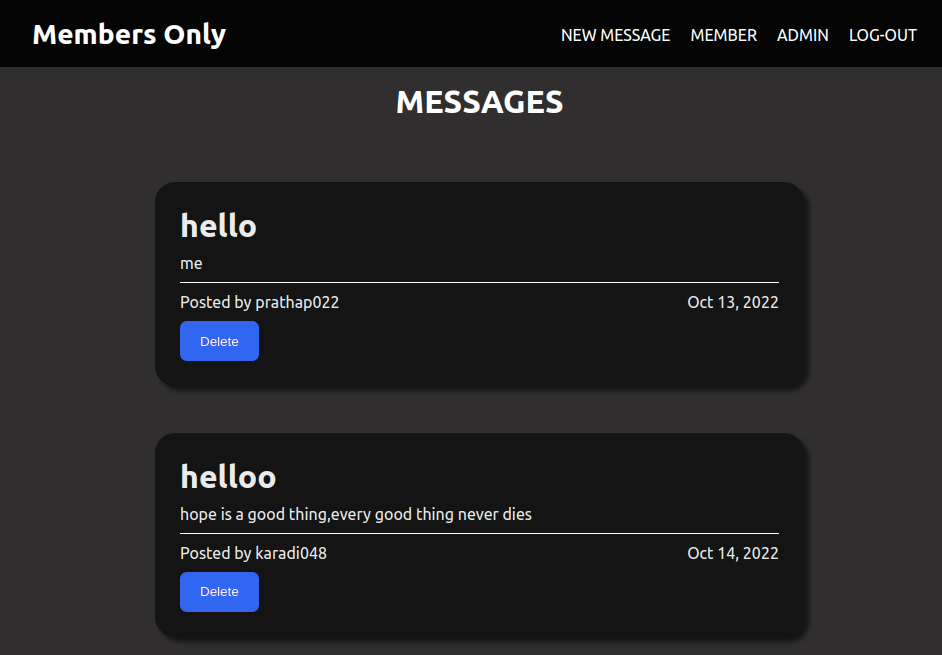

# Project-Members-Only

Preview -> [Check it out](https://fierce-cove-31113.herokuapp.com/)

## Summary :

Members only applicaion was built using nodejs and express. In this app user can login and create new message and become member after entering correct passcode and user can also become admin and delete messages on the app by entering correct passcode .For login authentication Passport middleware is used .In this password is encrypted with bcryptjs.

member passcode: ourclub ,
admin passcode: myclub

## Technologies used:

### Backend:
- Node with Express
- JS
- MongoDB with Mongoose
- Passport middleware
- bcrypt

### Frontend:
- HTML
- CSS
- PUG